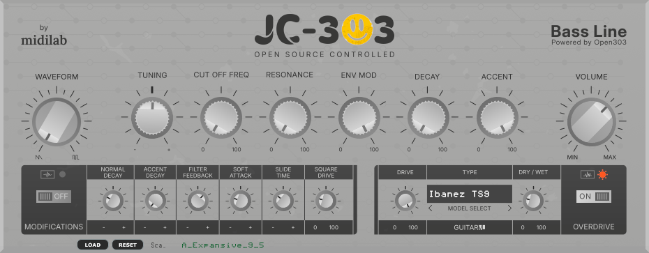

# JC-303 Plugin

This is a Free Roland TB-303 clone plugin. A Cmake JUCE port of [Robin Schmidt`s Open303](https://github.com/RobinSchmidt/Open303) with added features.



This software is licensed under the GNU General Public License version 3 (GPLv3).

The Open303 engine part of this software is also licensed under the MIT License.

## AnaMark `.tun` microtuning

Load AnaMark TUN files so every MIDI note can use a custom frequency map (just intonation, non-12-TET scales, etc.).

| Control | Action |
|---------|--------|
| **LOAD** | Open a file chooser for AnaMark `.tun` files |
| **RESET** | Return to 12-tone equal temperament |
| **Scale name** | Shows the active tuning name (or `12-TET` when reset) |

Details:

- 128-note absolute frequency table (Hz) shared by note-on, slide, and release paths in Open303.
- Pitch always resolves through a double-buffered frequency map (installed from the UI/state path; audio only reads).
- Open303 owns the live pitch bank only; custom vs 12-TET policy lives in the plugin layer.
- The existing **TUNING** knob remains master A4 fine-tune for **12-TET only**. While a custom map is active, note pitches come from the file.
- Custom tuning is saved/restored with host/plugin state as absolute frequencies (project does not need the original `.tun` file).
- **Exact Tuning**: requires `BaseFreq` and all 128 note entries (fail closed).
- **Functional Tuning**: requires `InitEqual` (seeds full 12-TET); `Note` lines apply as `freq[T] = freq[B] * 2^(cents/1200)` in file order (chained `#=` bases supported).
- UI lives in the bottom strip of the **amadeusp** skin without changing the editor size (930×363).

Parser smoke test (no JUCE): from `src/dsp/tuning/`, build and run `tuning_smoke_test.cpp` with `TuningFileLoader.cpp`.

## Download

Supports Windows, Linux and MacOS. You may find CLAP, VST3, LV2 and AU formats available to download. For VST2 plugin you need to compile it by your own self using vst2 sdk from Steinberg - vstsdk2.4.

MacOS Universal - Intel and ARM: [jc303-macos_universal-plugins.zip](https://github.com/midilab/jc303/releases/download/v0.12.3/jc303-0.12.3-macos_universal-plugins.zip)

Windows Intel x64: [jc303-windows_x64-plugins.zip](https://github.com/midilab/jc303/releases/download/v0.12.3/jc303-0.12.3-windows_x64-plugins.zip)

Linux Intel x64: [jc303-linux_x64-plugins.zip](https://github.com/midilab/jc303/releases/download/v0.12.3/jc303-0.12.3-linux_x64-plugins.zip)  

Linux ARM64: Soon...  

> Note: the official download packs above are midilab stock releases and may not include this TUN feature until it is merged upstream. Build from this branch to get AnaMark support.

## Installation

The platform zip pack will contain a folder per plugin format, just pick the format you want to install and copy the content of the folder to your OS plugin format folder.

**MacOs De-Quarantine**: MacOs users needs to de-quarantine plugin before load it into any DAW.  
Open a terminal window and do the following
```shell
$ sudo xattr -rd com.apple.quarantine /Library/Audio/Plug-Ins/Components/JC303.component
```
This de-quarantine example is for AU, please do the same for other formats you'll be using

## Build

Generate the cmake project build files first for the OS of your choice.  

#### cmake options

| Variable | Description | Default |
|--|--|--|
| GUI | Select GUI theme interface to use | amadeusp |
  
Avaliable themes: amadeusp, midilab  
  
To change JC303 GUI theme add the following to the first cmake call: -D GUI=midilab  
  
### Apple Xcode

To generate an **Xcode** project, run:

```sh
cmake -B build -G Xcode -D CMAKE_OSX_ARCHITECTURES=arm64\;x86_64 -D CMAKE_OSX_DEPLOYMENT_TARGET=10.13
```

The `-D CMAKE_OSX_ARCHITECTURES=arm64\;x86_64` flag is required to build universal binaries.

The `-D CMAKE_OSX_DEPLOYMENT_TARGET=10.13` flag sets the minimum MacOS version to be supported.

### Windows Visual Studio

To generate a **Visual Studio 2022 (17)** project, run:

```sh
cmake -B build -G "Visual Studio 17" -A x64
```

### GNU Linux

Install the dependecies:

#### Ubuntu

```sh
sudo apt install build-essential gcc cmake libx11-dev libxrandr-dev libxinerama-dev libxcursor-dev libfreetype6-dev libasound2-dev
```

To generate a **Linux CMake** project, run:

```sh
cmake -B build
```

## Compile

To compiled from the command line, run:

```sh
cmake --build build --config Release
```

#### VST2 Plugin

No distribution of VST2 plugin binaries is allowed without a license, but if you have the sdk and the license to use it just copy the vstsdk2.4/ SDK folder to the root of this project before run cmake.

## Roadmap

1. ~~Binary release for MacOS, Windows and Linux~~
2. ~~Graphical User Interface~~
3. ~~Internal parameters for engine tunning -Inspired on Devilfish Mod~~
4. ~~Overdrive~~
5. Preset Support
6. Step Sequencer
7. ~~AnaMark `.tun` microtuning (Load / Reset / state)~~
